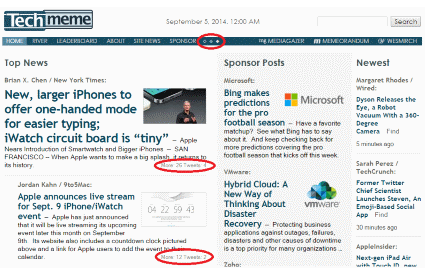

# Techmeme Less

Allows 'More' and 'Tweets' information within Techmeme pages to be hidden and optionally viewed.

# Building

Use grunt to build Firefox and Chrome extension files, and prepare the Safari extension for building

    grunt

This will create the following files:

- techmeme-less.zip (Chrome extension)
- techmeme_less.xpi (Firefox extension)

Th Safarai extension is built manually Safari's Extension Builder.

# Versioning

Version number currently needs to be manually edited for each extension.

| Browser | File | Information |
| ------- | ---- | ----------- |
| Firefox | firefox/package.json | 'version' key value |
| Chrome | source/manifest.json | 'version' key value |
| Safari | techmeme-less.safariextension/Info.plist | 'CFBundleShortVersionString' & 'CFBundleVersion' key values |
| Safari | techmeme-less.safariextension/Update.plist | 'CFBundleShortVersionString' & 'CFBundleVersion' key values |   